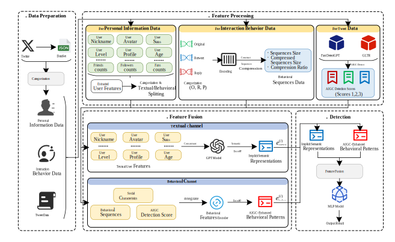

# TRACE-Bot

[](https://arxiv.org/abs/2604.02147)

TRACE-Bot is a unified dual-channel framework specifically engineered to profile and detect **LLM-driven social bots**. It jointly models implicit semantic representations and AIGC-enhanced behavioral patterns to capture the sophisticated characteristics of these emerging threats. TRACE-Bot constructs fine-grained representations from heterogeneous sources, including personal information data, interaction behavior data, and tweet data. The framework employs a dual-channel architecture: one channel captures linguistic artifacts via a pretrained language model, while the other captures behavioral irregularities through multidimensional activity features, augmented by signals from state-of-the-art AIGC detectors. Subsequently, the fused representations are classified via a lightweight prediction head.



The Data Preparation module handles data collection and preprocessing to ensure structured inputs. The Feature Processing module extracts multidimensional textual and behavioral features, capturing semantic traces and interaction patterns. Subsequently, the Feature Fusion module integrates these heterogeneous representations to enhance discriminative expressiveness. Finally, the Detection module utilizes the fused vectors for precise identification and classification of LLM-driven social bots.

## Project Structure

```
TRACE-Bot/
├── src/              # Data directory
│   ├── Fox8-23_Data            # Fox8-23 Data
│   └── BotSim-24_Data.zip      # BotSim-24 Data
├── src/              # Source code directory
│   ├── data_process.py         # Data processing and cleaning
│   ├── behavior_sequence.py    # Behavior sequence extraction
│   ├── GLTR_detection.py       # GLTR model detection
│   ├── fast_detectgpt.py       # Fast DetectGPT model detection
│   ├── feature_integration.py  # Feature integration
│   └── fusion_detection.py     # Feature fusion and model detection
├── README.md         # Project documentation
├── model.svg         # Model architecture diagram
└── requirements.txt  # Dependencies
```

## Datasets

### Fox8-23
> https://zenodo.org/records/8035290

The Fox8-23 dataset was constructed in 2023 by Yang et al. from Northeastern University. The authors observed that commercial LLMs (e.g., ChatGPT) employ reinforcement learning from human feedback (RLHF) as a safety mechanism: when prompted with policy-violating requests (e.g., harmful or false content), the model responds with a standardized disclaimer such as "as an AI language model, I cannot...". They hypothesized that LLM-driven bots, lacking proper content filtering, might inadvertently leak such disclaimers in their tweets, thereby revealing their non-human origin. Leveraging this insight, the team used Twitter API v2 to collect all tweets containing the phrase as an AI language model posted between October 1, 2022, and April 23, 2023. This yielded 12,226 tweets from 9,112 unique users. To validate labels, 100 users were randomly sampled and manually annotated; 24\% were confirmed as LLM-driven bots, while 76% were likely human. Additionally, the dataset includes 1,140 genuine human accounts (285 each) randomly drawn from four established bot datasets: Botometer-Feedback-2019, Gilani-17, Midterm-2018, and Varol-Icwsm.

### BotSim-24

> https://github.com/QQQQQQBY/BotSim/tree/main/BotSim-24-Dataset

The BotSim-24 dataset was introduced in 2024 by Qiao et al. from the Institute of Information Engineering, Chinese Academy of Sciences. To systematically study the security risks posed by LLM-driven bots, the authors developed BotSim, a novel simulation framework that leverages LLMs to emulate malicious social botnets. BotSim models real-world information diffusion and user interaction dynamics within a virtual social environment populated by intelligent agents and simulated human users, enabling high-fidelity replication of complex online behaviors. Built upon this framework, BotSim-24 is a large-scale, high-realism dataset that records multi-round interaction trajectories, content generation logs, and evolving social relationships of LLM-driven agents. It serves as a valuable benchmark for research on bot detection, disinformation propagation, and human-AI hybrid network modeling.

## Functional Modules

### 1. Data Processing and Cleaning (`src/data_process.py`)
- Processes NDJSON format data
- Converts data to CSV format
- Flattens nested JSON structures
- Performs data cleaning and preprocessing

### 2. Behavior Sequence Extraction (`src/behavior_sequence.py`)
- Extracts user tweet types (original, retweet, reply)
- Constructs behavior sequences
- Calculates features such as sequence compression ratio

### 3. AIGC Detection - GLTR (`src/GLTR_detection.py`)
- Calculates text probabilities using BERT and GPT-2 models
- Generates GLTR detection scores as features

### 4. AIGC Detection - Fast DetectGPT (`src/fast_detectgpt.py`)
- Detects text using the Fast DetectGPT model
- Generates detection scores as features

### 5. Feature Integration (`src/feature_integration.py`)
- Extracts user personal information features
- Integrates all features into a single feature data file

### 6. Feature Fusion and Model Detection (`src/fusion_detection.py`)
- Uses GPT-2 as the text semantic encoder
- Fuses behavioral features and text features
- Trains and evaluates the social bot detection model

## Workflow

1. **Data Processing**: Run `src/data_process.py` to process raw data.
2. **Behavior Sequence Extraction**: Run `src/behavior_sequence.py` to extract behavior sequence features.
3. **AIGC Detection**:
   - GLTR Features:
     - Download the BERT and GPT-2 models from [Hugging Face](https://huggingface.co/).
     - Run `src/GLTR_detection.py` to generate features.
   - Fast DetectGPT Features:
     - Download the source code from the [Fast DetectGPT Github repository](https://github.com/baoguangsheng/fast-detect-gpt).
     - Ensure the source code is located in the correct directory.
     - Run `src/fast_detectgpt.py` to generate features.
5. **Feature Integration**: Run `src/feature_integration.py` to integrate all features.
6. **Model Training and Detection**: Run `src/fusion_detection.py` (Note: corrected from `feature_fusion.py` in original text to match file structure) to train the model and perform detection.

## Dependencies

- Python 3.8+
- pandas
- numpy
- torch
- transformers
- scikit-learn
- tqdm

## Notes

- Running AIGC detection models requires significant computational resources; execution on a GPU environment is recommended.
- Required pretrained models will be automatically downloaded upon the first run.
- Data processing and feature extraction steps may take considerable time, depending on the data scale.

## Cite

This work has been submitted to arXiv. If you find TRACE-Bot useful in your research, please cite our paper:

```bibtex
@misc{wang2026tracebotdetectingemergingllmdriven,
      title={TRACE-Bot: Detecting Emerging LLM-Driven Social Bots via Implicit Semantic Representations and AIGC-Enhanced Behavioral Patterns}, 
      author={Zhongbo Wang, Zhiyu Lin, Zhu Wang and Haizhou Wang},
      year={2026},
      eprint={2604.02147},
      archivePrefix={arXiv},
      primaryClass={cs.AI},
      url={https://arxiv.org/abs/2604.02147}, 
}
```
